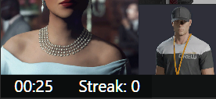

# Croupier Setup

## App vs. Mod

First thing to understand is that Croupier has two parts: an app and a mod. The app is just like any ordinary Windows application and is the main part of Croupier. You can use this alone to generate spins and don't need to have the game installed to use.

Installation of the app is as simple as extracting the `App - Install Anywhere` files to a convenient location, then launching the `Croupier.exe` executable.

> **Note:** It's recommended to extract the app to somewhere you would usually install software or a convenient folder on the desktop, rather than to your game install directory. Epic Games Launcher will not launch the game if any app within the game folder is already running.

However, the app cannot provide game integration features such as in-game overlays, live kill validation and tracking mission completions, which is where the mod comes in.

Installation of the mod requires the ZHMModSDK: https://github.com/OrfeasZ/ZHMModSDK

After installing the SDK, simply extract the `Croupier.dll` from `Mod - Install to Game` to the SDK mods folder within your game's install directory (`HITMAN3/Retail/mods`).

With the mod installed and the game and Croupier app running, Croupier should now be able to connect to the game.

> Remember that the mod is not a requirement to use Croupier, but is required for game integration. The mod also contains a lightweight generator, so technically the app is not required either and spins can be generated within the mod, however this generator is somewhat of a legacy feature that is not being kept updated or 'RR-compliant', so bear in mind that you probably want either just the app, or both the app and the mod.

## App Interface

When you first run the Croupier app, you should see the window with a toolbar and your first random spin displayed.

### Toolbar

Let's first break down the toolbar...

The **Mission select** drop-down allows you to choose from any of the Hitman missions supported by Croupier. Whenever you select a new mission, a spin will be generated for that mission.

The **Spin history** buttons allow you to go backward or forward through the last 30 spins.

The **Spin lock** button can be clicked to toggle 'Spin Lock'. This feature is simply to prevent Croupier spinning automatically based on planning screen detection, in case you want to replay the same spin or prefer to manually generate spins.

The **Edit spin** button will open a window allowing you to manually set the conditions of the spin.

The **Random mission** button will select a random mission and generate a spin for it. You can customise the pool of missions that can be randomly selected, more on that later.

Finally, the **Respin** button simply generates a new spin for the current mission.

### Spin Display

Obviously, below the toolbar we have the 'spin display'. There's not much that needs explaining here, I just want to establish 'spin display' as the term for this part of the window as I'll use it later :)

### Configuration Menu

Croupier has a lot of options for configuration and customisation, and many more features. You can explore these by right-clicking anywhere on the Croupier window...

#### Features
At the top of this menu are some of the core features provided by Croupier.

- **History:** lets you view the previous spins in more detail and revisit them more easily than with the back/forward buttons. This history is saved between Croupier sessions.
- **Bookmarks:** lets you add or remove the current spin to a list of spins Croupier will remember this list, allowing you to come back to any of them later.
- **Copy Spin:** lets you copy a textual representation of the spin. Using the expanded menu, you can even copy a shareable link for any spin.
- **Paste Spin:** lets you 'paste' a spin from text. This option will be grayed out if the text in your clipboard cannot be understood by Croupier as a valid spin.
- **Timer:** lets you toggle the timer on/off.
- **Streak:** lets you toggle streaks on/off.
- **Kill Confirmations:** toggles whether the spin display includes icons that indicate whether Croupier detected that kills were done correctly.

#### Settings
At this part of the menu we get to some more technical settings.

- **Target Name Format:** allows you to customise how target names appear in the 'History' and 'Bookmarks' menus, and also how spins are formatted when copied to text. You can have target names be represented as full names, short names or initials.
- **Always On Top:** allows you to pin the window on top of other windows on your desktop.
- **Right to Left:** enable if you want the UI in right-to-left mode.
- **Vertical Display:** enable if you want the spin display to list conditions in a single vertical column rather than a grid.
- **Static Size:** enable to make the window size static. By default, the window grows or shrinks depending on how many targets are in the mission, which is fine for most users. However if you intend to capture the Croupier window (for streaming/recording etc.), it's recommended to enable this so the window doesn't change size. This will allow you to position and size Croupier's display consistently in your scene.
- **Static Size Align Left:** by default, static size aligns the spin to the right, perfect for putting on the right side of the screen in a stream or recording. Enable this to switch it to align left so it fits better on the left side of the screen.

#### Windows

This part of the menu contains entries to open extra windows for even more features.

- **Statistics:** opens the 'Statistics' window which gives you an overview of stats Croupier has collected based on your gameplay during spins, and also a full history of spins that you have completed, what times you got etc.
- **Hitmaps/Web Link**: opens a window that allows using a web link such as a Hitmaps spin link to monitor for spins, so that Croupier reflects what is on the webpage. This requires installing an (optional) headless Chrome browser component, which can be done entirely within this window.
- **LiveSplit:** opens the LiveSplit integration window for customisation of the speed running software. Here you can enable connecting to LiveSplit and customise the IP and port if needed (in most cases it is not needed). The status will also help you confirm if Croupier has connected to the LiveSplit Server (remember to add the server to your LiveSplit layout and use Control -> Start Server in LiveSplit).
- **Map Pool:** opens a window allowing you to choose which missions are considered when you use the 'Random mission' button. There are a few common presets to choose from, but you can also set your own custom pool.
- **Rulesets:** opens a window allowing you to set the current RR-based ruleset. Rulesets tell Croupier which condition combinations are legal for which targets, among other technicalities in spin generation.

#### And a few more

- **Daily Spins:** so long as Croupier can connect to the required server, this sub-menu will display today's 3 daily spin options, as well as an entry to refresh them manually if needed (Croupier will not connect to any servers automatically if 'Check On Launch' is not enabled under 'Update Check').
- **Update Check:** updates are important, so this menu allows you to check if any are available or toggle the 'Check On Launch' option, if you prefer to disable all automatic remote connection attempts by Croupier (security and choice is also important). If an update is available, a popup will appear to inform you.
- **Exit:** because otherwise closing Croupier would be absolutely impossible (just kidding).

### Status Bar

When you first launch Croupier, there will be no status bar, but if you enable the Timer or Streaks from the menu, one will appear below the spin display...

The status bar will show the timer and current streak status.

You can also right-click the items in this status bar for a few options specific to the timer and streaks...

#### Timer Menu

- **Timer & Streak Settings:** opens a window allowing further configuration timer & streak related options.
- **Reset:** stops and resets the timer to 0:00.
- **Start:** starts the timer.
- **Stop:** pause the timer.
- **Show Fractions:** toggle showing fractions in the timer.
- **Multi-Spin Mode:** enable if you want to time completion of multiple spins rather than just a single one, e.g. if you want to run roulette trilogy.

#### Streak Menu

- **Timer & Streak Settings:** opens a window allowing further configuration timer & streak related options.
- **Show Personal Best:** toggles whether the PB is shown in addition to the current streak.
- **Reset:** resets the streak.

#### Timer & Streak Settings Window

  - **Current Streak / Personal Best:** You can reset your current streak and/or streak PB.
  - **Require Confirmed Kills:** Toggles whether kill validation should be required for streaks. It's recommended to keep this on, but this option is provided in case any bugs in kill confirmations exist.
  - **Replan Window:** Allows you to set an amount of time, during which you are allowed 1 replan/restart without affecting your streak.
  - **Timing Mode:** Allows you to set the timing mode for the timer.
  - **Reset On Mission Select:** allows you to set a 'reset' mission, so that if you go back to the planning screen for that mission for a new spin, Croupier will reset the timer. You may set 'Paris - The Showstopper' if you're running trilogy for example.
  - **Auto-Spin Countdown:** when set at 0, Croupier generates spins for a mission as soon as it detects you in the planning screen for that mission. You can increase this up to 30 to give yourself that many seconds of a countdown before the spin is actually generated. This countdown will be shown on the timer.
