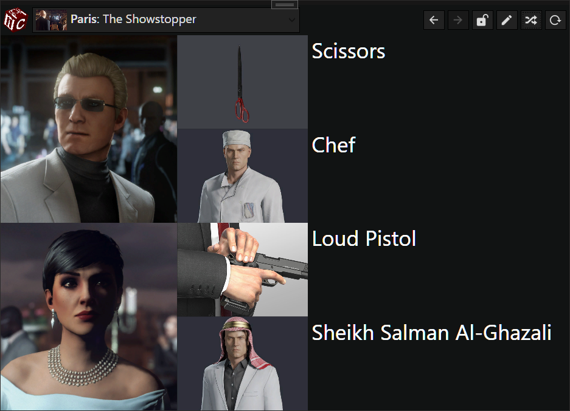
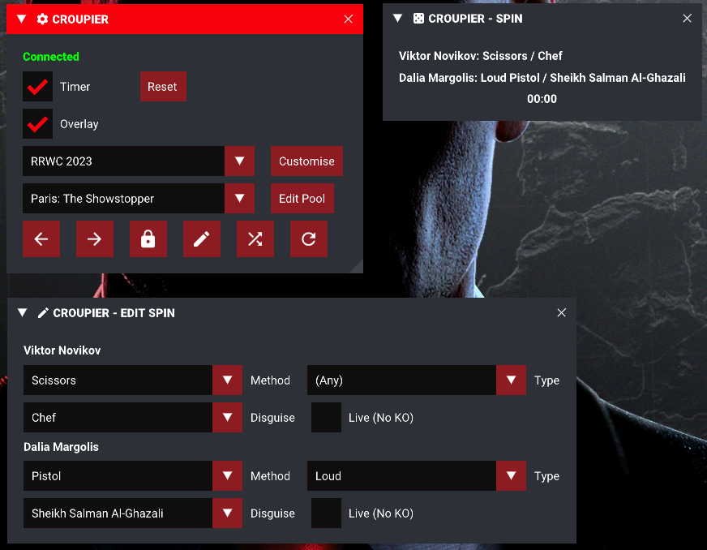

# Croupier

Croupier is an app and mod providing a generator of roulette spins for Hitman: World of Assassination that can be easily controlled from in-game and provides many options for customisation.

Go on, take it for a spin.

## Download & Setup

1. There are two parts; an app, and a mod. The app provides the most features, and the mod provides integration with the game. You can use either one individually, but using them both together is recommended for the best experience.
2. The app works great standalone for generating spins
3. The mod is effectively a remote control for the app, though it also has a lightweight version of some features built-in.
4. See the following sections for instructions for each part of Croupier.
5. (If using both) Launch the app and game in any order. 'Connected' should appear in the in-game UI once it detects the app running. You can now control the app via the in-game UI (and vice-versa).

### App
1. Extract the contents of `App - Install Anywhere` to a location of your choosing. This does not need to be in the game installation folder.
2. Run `Croupier.exe` and enjoy.

### Mod
1. Download the latest version of [ZHMModSDK](https://github.com/OrfeasZ/ZHMModSDK/releases) and install it.
2. Extract the contents of `Mod - Install to Game` to the game installation folder (e.g. `C:\Games\HITMAN 3` - merge with existing 'Retail' folder).
3. Run the game and once in the main menu, press the `~` key (`^` on QWERTZ layouts) and enable `Croupier` from the menu at the top of the screen.
4. Use the in-game ZHMModSDK UI to control the app or generate spins using the in-game overlay.
