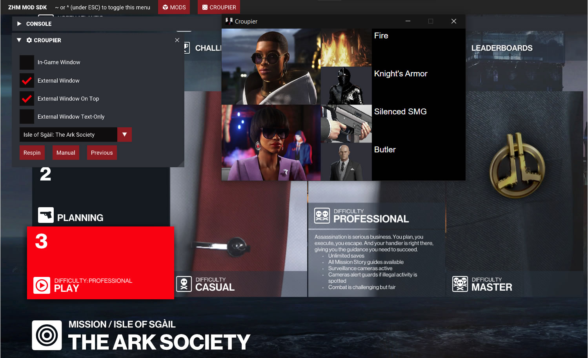
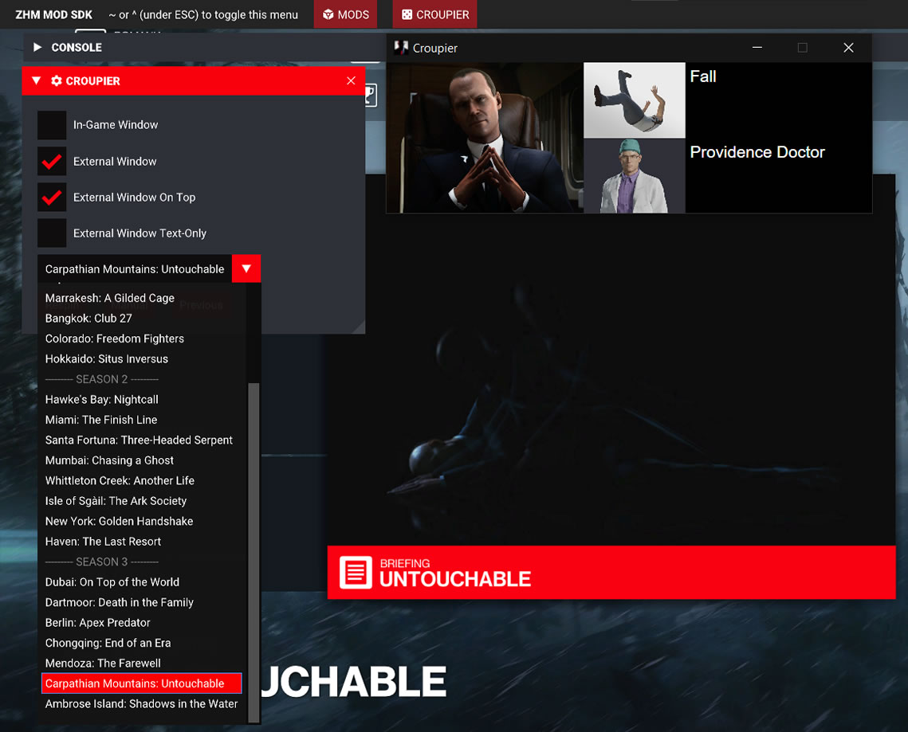
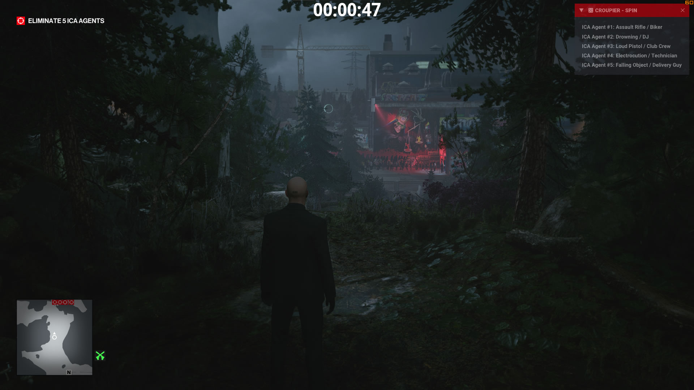
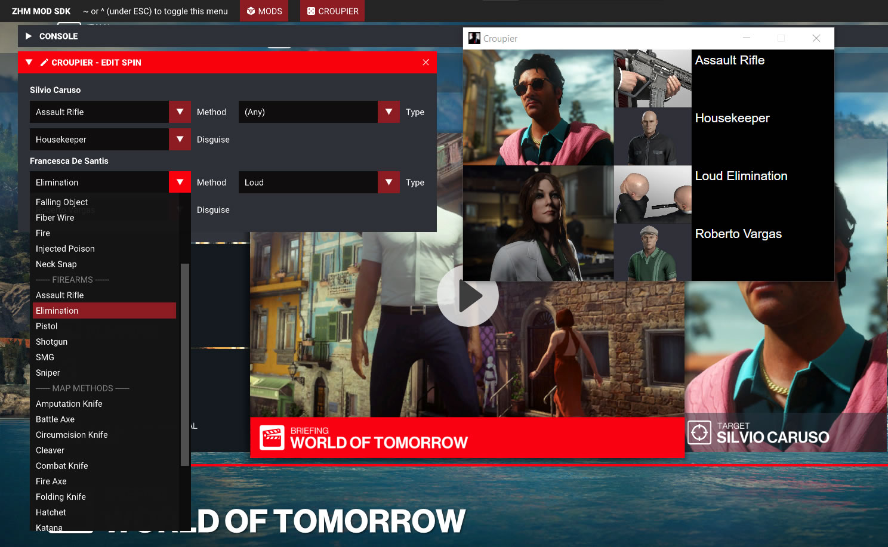
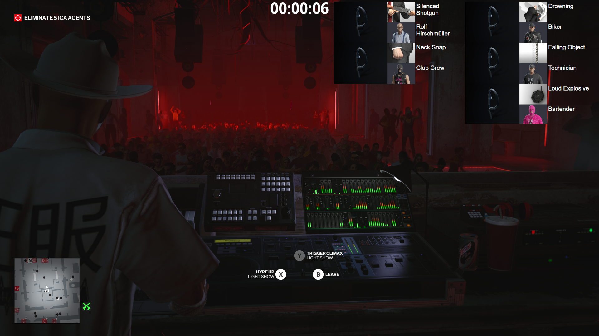

# Croupier

Live generator for roulette spins in Hitman 3. Automatically generates kill condition and disguise combinations for mission targets on mission planning screen and tracks completion of the mission.

## Features

### Automatic Mission Detection

Spins are automatically generated for the mission currently active in-game. Play through the entire trilogy without needing to Alt-TAB to generate spins.

_This feature requires being in online mode._

### All Main Missions

Supports every mission in the main campaign, including tutorial missions (Freeform Training, The Final Test, Nightcall), Untouchable and Shadows in the Water.

_Support for bonus missions and special assignments is WIP._

### Completion Detection

Croupier can detect completion of the current mission. Current spin will not be overwritten by a new one for mission replans/restarts until the current mission is completed.

_Support for live validation of target kills is WIP._

### In-Game UI

Allows manual selection of mission, fully custom spins, respins, and going back through the spin history, as well as some customisation options. You can also display spins in-game in an unobtrusive, semi-transparent window.

### Custom Spins

Spins can be specified with the entire range of conditions available in each mission.

### Configurable Rulesets

Built-in support for the following Roulette Rivals tournaments rulesets: **RR12**, **RR11**. Also supports **custom** rulesets.

Spins are generated to comply with the chosen ruleset, preventing unwanted kill conditions or ones that are known to be impossible, unbalanced or bugged.

_WIP feature, more options are being added._

### Stream Friendly

External window displays the spins with images and is perfect for window capturing in OBS (use #000000 colour key with similarity and smoothness set to 1).

_Additional support for layout customisation is WIP._

## Installation Instructions

1. Download the latest version of [ZHMModSDK](https://github.com/OrfeasZ/ZHMModSDK/releases) and install it.
2. Download the latest version of `Croupier` and copy it to the ZHMModSDK `mods` folder (e.g. `C:\Games\HITMAN 3\Retail\mods`).
3. Run the game and once in the main menu, press the `~` key (`^` on QWERTZ layouts) and enable `Croupier` from the menu at the top of the screen.
4. Use the in-game ZHMModSDK UI for respins, manual mission selection and configuration changes.

## Building

### 1. Clone this repository locally with all submodules.

You can either use `git clone --recurse-submodules` or run `git submodule update --init --recursive` after cloning.

### 2. Install Visual Studio (any edition).

Make sure you install the C++ and game development workloads.

### 3. Open the project in your IDE of choice.

See instructions for [Visual Studio](https://github.com/OrfeasZ/ZHMModSDK/wiki/Setting-up-Visual-Studio-for-development) or [CLion](https://github.com/OrfeasZ/ZHMModSDK/wiki/Setting-up-CLion-for-development).
